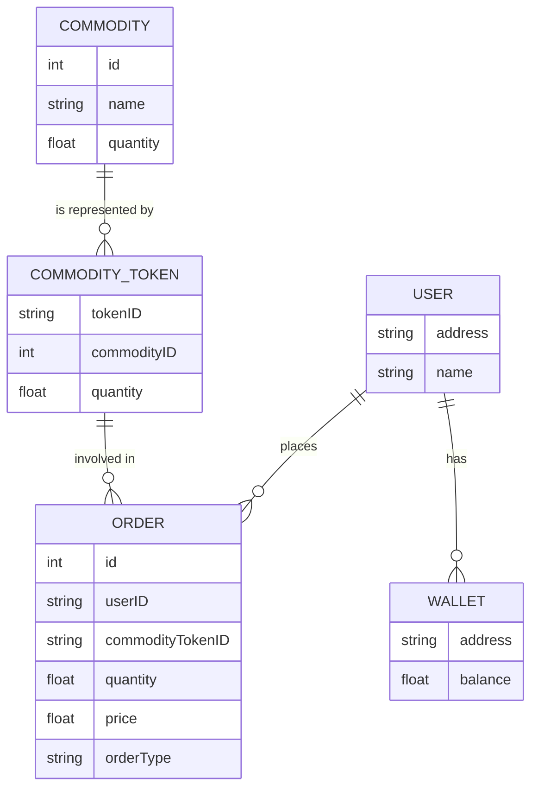
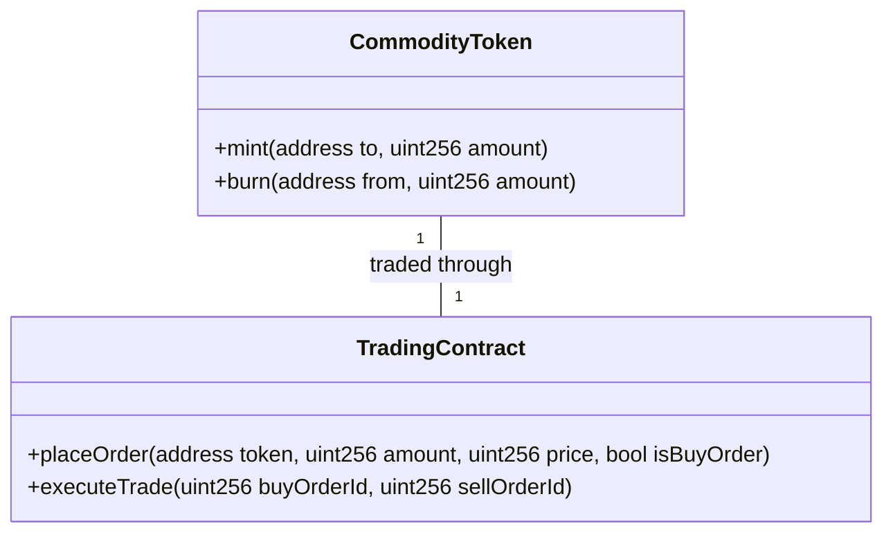
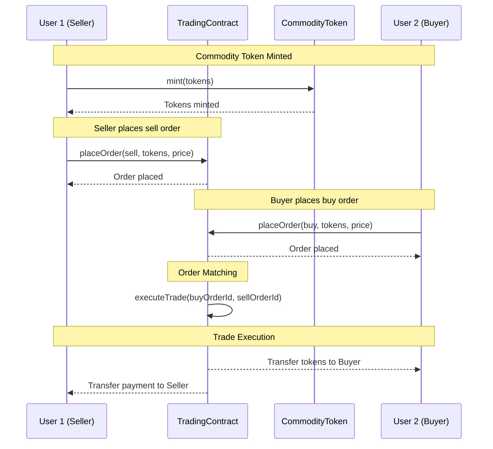

# Commodity Trading dApp - Sprint 2: Design and Prototyping

## Sprint Overview

In this sprint, we aim to develop a functional prototype of our commodity trading platform. This includes initial smart contract development and the creation of a basic front-end interface.

### Objectives

- Develop prototype smart contracts for commodity trading.
- Create an initial layout and design for the front-end interface.
- Plan for integration between smart contracts and the front-end.

## Smart Contract Development

### Tasks

- **Commodity Token Contract (ERC-20)**
  - Develop a basic ERC-20 token contract to represent different commodities.
  - Functions to include: `mint`, `burn`, and standard ERC-20 functions.

- **Trading Contract**
  - Initial contract for handling order placements and executions.
  - Basic functions: `placeOrder`, `executeTrade`.

### Tools

- **Hardhat**: For development and testing of smart contracts.
- **Solidity**: Programming language for writing smart contracts.

## Front-End Development

### Tasks

- **UI/UX Design**
  - Sketch the basic layout of the application.
  - Design user interface components for commodity listings and order placements.

- **Prototype Development**
  - Initiate the development using React.js.
  - Focus on essential features: wallet connection, displaying commodity information.


# Commodity Trading dApp - Implementation Document

## Data Model: Entity Relationship Diagram

The ERD visually represents the data relationships within the dApp.

### ERD Diagram



### Description

- **USER**: Represents participants in the dApp.
- **WALLET**: Stores user's cryptocurrency for trading.
- **COMMODITY**: Represents the actual physical commodities.
- **COMMODITY_TOKEN**: ERC-20 tokens representing commodities.
- **ORDER**: Buy or sell orders placed by users.

## Smart Contract Structure: Class Diagram

The Smart Contract Structure: Class Diagram illustrates the structure of smart contracts and their methods.

### Smart Contract Structure: Class Diagram



### Description

- **CommodityToken**: An ERC-20 token representing a specific commodity.
- **TradingContract**: Handles the placing and execution of trade orders.

## Solidity Code

### CommodityToken Contract

```solidity
// SPDX-License-Identifier: MIT
pragma solidity ^0.8.0;

import "@openzeppelin/contracts/token/ERC20/ERC20.sol";

contract CommodityToken is ERC20 {
    constructor(string memory name, string memory symbol) ERC20(name, symbol) {}

    function mint(address to, uint256 amount) public {
        _mint(to, amount);
    }

    function burn(address from, uint256 amount) public {
        _burn(from, amount);
    }
}
```

### TradingContract

```solidity
// SPDX-License-Identifier: MIT
pragma solidity ^0.8.0;

contract TradingContract {
    struct Order {
        uint256 id;
        address user;
        address token;
        uint256 amount;
        uint256 price;
        bool isBuyOrder;
    }

    uint256 private nextOrderId;
    mapping(uint256 => Order) public orderBook;

    function placeOrder(address token, uint256 amount, uint256 price, bool isBuyOrder) public {
        uint256 orderId = nextOrderId++;
        orderBook[orderId] = Order(orderId, msg.sender, token, amount, price, isBuyOrder);
        // Additional logic to handle order placement
    }

    function executeTrade(uint256 buyOrderId, uint256 sellOrderId) public {
        // Logic to match and execute trades
    }

    // Additional functions as needed
}
```

### Notes

- The **CommodityToken** contract is a basic ERC-20 token representing commodities.
- The **TradingContract** includes functions for placing orders and executing trades. Additional logic will be needed to match orders and manage trades.
- This code serves as a foundational starting point and will need further development, testing, and security auditing.


## User Interaction Flow: Sequence Diagram: User Interactions

This sequence diagram illustrates how different users interact with the commodity trading dApp.

### User Interaction Flow: Sequence Diagram



### Description

- **User 1 (Seller)**: Mints commodity tokens and places a sell order on the TradingContract.
- **User 2 (Buyer)**: Places a buy order for the commodity tokens on the TradingContract.
- **TradingContract (TC)**: Executes the trade by matching buy and sell orders, transferring tokens to the buyer and payment to the seller.
- **CommodityToken (CT)**: ERC-20 token representing the commodities, minted and transferred during the trade.
